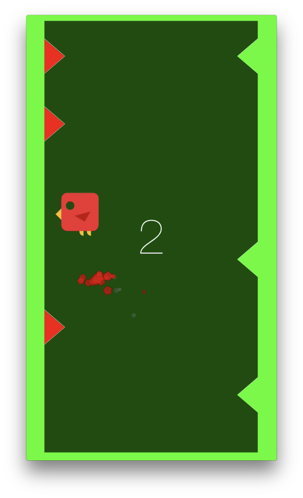
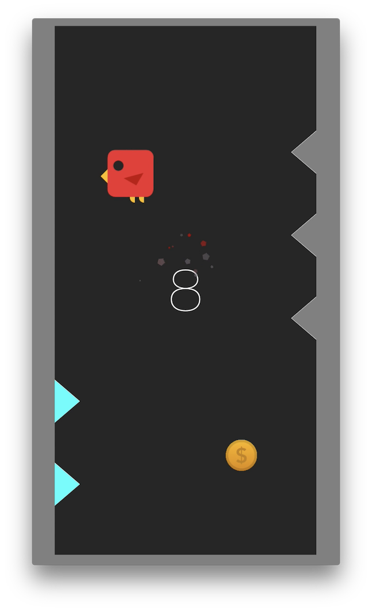
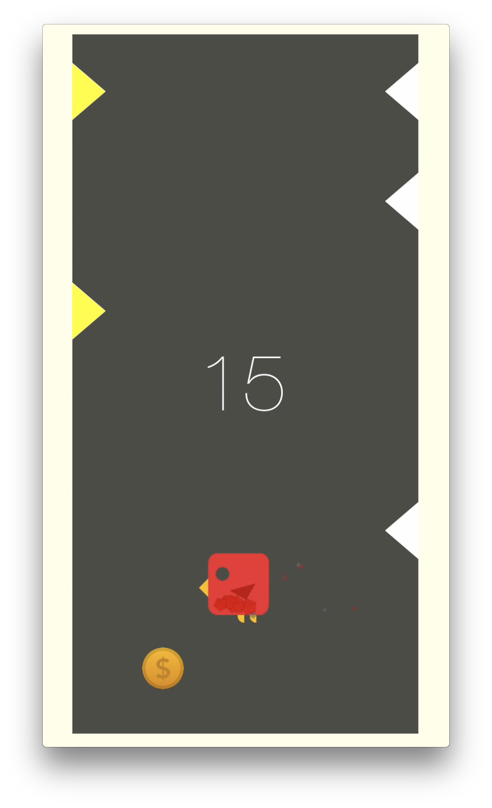

# iOS Game - Bouncing Bird
## Project for 'Programming for Mobile Apple iOS and MacOS X' course at Warsaw University of Technology

[Gameplay on Youtube](https://youtu.be/u96hLYSztEM)

A simple iOS game created in Xcode 10.1 using Swift 4.2 and SpriteKit. This is my first app for Apple devices and first experience with Swift language.

## Screens

## Copyright © 2019 Robert Dudziński
